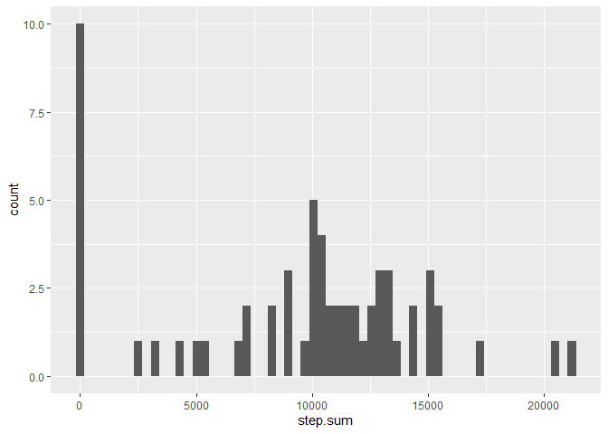
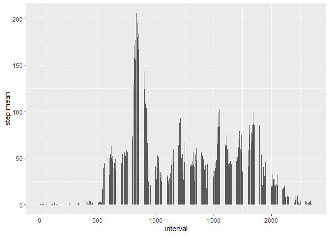
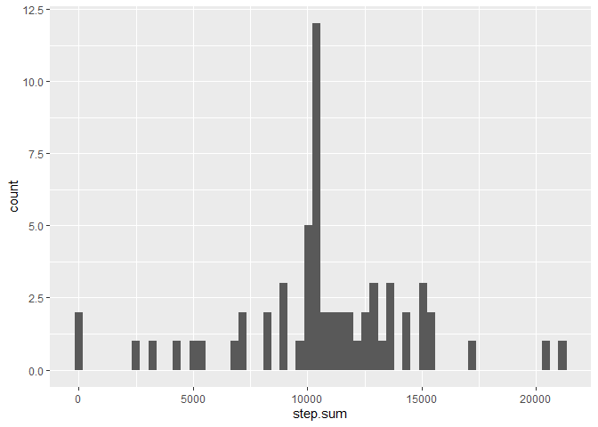
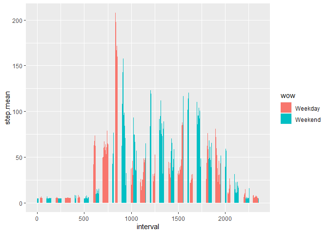

## Loading and preprocessing the data

The first seciton of this document will go over loading and processing the data. First, we will load the libraries we will need however:


```r
library(vroom)
library(tidyverse)
```

```
## Registered S3 methods overwritten by 'readr':
##   method                    from 
##   as.data.frame.spec_tbl_df vroom
##   as_tibble.spec_tbl_df     vroom
##   format.col_spec           vroom
##   print.col_spec            vroom
##   print.collector           vroom
##   print.date_names          vroom
##   print.locale              vroom
##   str.col_spec              vroom
```

```
## -- Attaching packages --------------------------------------- tidyverse 1.3.2 --
## v ggplot2 3.3.6      v purrr   0.3.4 
## v tibble  3.1.8      v dplyr   1.0.10
## v tidyr   1.2.1      v stringr 1.4.1 
## v readr   2.1.2      v forcats 0.5.2 
## -- Conflicts ------------------------------------------ tidyverse_conflicts() --
## x readr::col_character()   masks vroom::col_character()
## x readr::col_date()        masks vroom::col_date()
## x readr::col_datetime()    masks vroom::col_datetime()
## x readr::col_double()      masks vroom::col_double()
## x readr::col_factor()      masks vroom::col_factor()
## x readr::col_guess()       masks vroom::col_guess()
## x readr::col_integer()     masks vroom::col_integer()
## x readr::col_logical()     masks vroom::col_logical()
## x readr::col_number()      masks vroom::col_number()
## x readr::col_skip()        masks vroom::col_skip()
## x readr::col_time()        masks vroom::col_time()
## x readr::cols()            masks vroom::cols()
## x readr::date_names_lang() masks vroom::date_names_lang()
## x readr::default_locale()  masks vroom::default_locale()
## x dplyr::filter()          masks stats::filter()
## x readr::fwf_cols()        masks vroom::fwf_cols()
## x readr::fwf_empty()       masks vroom::fwf_empty()
## x readr::fwf_positions()   masks vroom::fwf_positions()
## x readr::fwf_widths()      masks vroom::fwf_widths()
## x dplyr::lag()             masks stats::lag()
## x readr::locale()          masks vroom::locale()
## x readr::output_column()   masks vroom::output_column()
## x readr::problems()        masks vroom::problems()
```

```r
library(ggplot2)
```

Now, we will load in the data:


```r
data <- vroom("activity.zip")
```

```
## Rows: 17568 Columns: 3
## -- Column specification --------------------------------------------------------
## Delimiter: ","
## dbl  (2): steps, interval
## date (1): date
## 
## i Use `spec()` to retrieve the full column specification for this data.
## i Specify the column types or set `show_col_types = FALSE` to quiet this message.
```

```r
str(data)
```

```
## spec_tbl_df [17,568 x 3] (S3: spec_tbl_df/tbl_df/tbl/data.frame)
##  $ steps   : num [1:17568] NA NA NA NA NA NA NA NA NA NA ...
##  $ date    : Date[1:17568], format: "2012-10-01" "2012-10-01" ...
##  $ interval: num [1:17568] 0 5 10 15 20 25 30 35 40 45 ...
##  - attr(*, "spec")=
##   .. cols(
##   ..   steps = col_double(),
##   ..   date = col_date(format = ""),
##   ..   interval = col_double()
##   .. )
##  - attr(*, "problems")=<externalptr>
```

## What is mean total number of steps taken per day?

This section will answer the question "What is the mean total number of steps taken per day?" It will ignore missing values as well. 

In addition to the mean, it will also provide a histogram, the median, and the total number of steps taken per day.


```r
aggData <- data %>%
                group_by(date) %>%
                summarise(step.sum = sum(steps, na.rm = TRUE))
str(aggData)
```

```
## tibble [61 x 2] (S3: tbl_df/tbl/data.frame)
##  $ date    : Date[1:61], format: "2012-10-01" "2012-10-02" ...
##  $ step.sum: num [1:61] 0 126 11352 12116 13294 ...
```

```r
ggplot(aggData, aes(x = step.sum)) + geom_histogram(bins = 60)
```

<!-- -->

```r
aggMean <- mean(aggData$step.sum)
aggMedian <- median(aggData$step.sum)

c("Mean" = aggMean,"Median" = aggMedian)
```

```
##     Mean   Median 
##  9354.23 10395.00
```

## What is the average daily activity pattern?

This section will answer the question "What is the average daily activity pattern?".

It will make a time series plot of the 5-minute intervals and the average number of steps taken, averaged across all days.


```r
aggData2 <- data %>%
                group_by(interval) %>% 
                summarise(step.mean = mean(steps, na.rm = TRUE)) %>%
                arrange(desc(step.mean))
str(aggData2)
```

```
## tibble [288 x 2] (S3: tbl_df/tbl/data.frame)
##  $ interval : num [1:288] 835 840 850 845 830 820 855 815 825 900 ...
##  $ step.mean: num [1:288] 206 196 183 180 177 ...
```

```r
# Chart

ggplot(aggData2, aes(x = interval, y = step.mean)) + geom_col()
```

<!-- -->

```r
# Max interval

aggData2[1,]
```

```
## # A tibble: 1 x 2
##   interval step.mean
##      <dbl>     <dbl>
## 1      835      206.
```

## Imputing missing values

This section will deal with imputing the missing values. It will do the following:

Calculate and report the total number of missing values in the dataset, fill in all of the missing values in the dataset using the median value, create a new dataset that is equal to the original dataset but with the missing data filled in, and make a histogram of the total number of steps taken each day and Calculate and report the mean and median total number of steps taken per day. 

* Do these values differ from the estimates from the first part of the assignment? 
* What is the impact of imputing missing data on the estimates of the total daily number of steps?

 
Here is the code:


```r
# missing values
summary(data)
```

```
##      steps             date               interval     
##  Min.   :  0.00   Min.   :2012-10-01   Min.   :   0.0  
##  1st Qu.:  0.00   1st Qu.:2012-10-16   1st Qu.: 588.8  
##  Median :  0.00   Median :2012-10-31   Median :1177.5  
##  Mean   : 37.38   Mean   :2012-10-31   Mean   :1177.5  
##  3rd Qu.: 12.00   3rd Qu.:2012-11-15   3rd Qu.:1766.2  
##  Max.   :806.00   Max.   :2012-11-30   Max.   :2355.0  
##  NA's   :2304
```

2304 NAs.

To replace the NAs, we will use the agregated median per day, divided by how many intervals there are: `aggMedian/nrow(aggData2)`.


```r
imputed <- replace_na(data$steps, (aggMedian/nrow(aggData2)))
data[,1] <- imputed 
str(data)
```

```
## spec_tbl_df [17,568 x 3] (S3: spec_tbl_df/tbl_df/tbl/data.frame)
##  $ steps   : num [1:17568] 36.1 36.1 36.1 36.1 36.1 ...
##  $ date    : Date[1:17568], format: "2012-10-01" "2012-10-01" ...
##  $ interval: num [1:17568] 0 5 10 15 20 25 30 35 40 45 ...
##  - attr(*, "spec")=
##   .. cols(
##   ..   steps = col_double(),
##   ..   date = col_date(format = ""),
##   ..   interval = col_double()
##   .. )
##  - attr(*, "problems")=<externalptr>
```

```r
# Now, let's reuse the code from earlier to see how different it is: 

aggData <- data %>%
                group_by(date) %>%
                summarise(step.sum = sum(steps, na.rm = TRUE))
str(aggData)
```

```
## tibble [61 x 2] (S3: tbl_df/tbl/data.frame)
##  $ date    : Date[1:61], format: "2012-10-01" "2012-10-02" ...
##  $ step.sum: num [1:61] 10395 126 11352 12116 13294 ...
```

```r
ggplot(aggData, aes(x = step.sum)) + geom_histogram(bins = 60)
```

<!-- -->

```r
aggMean2 <- mean(aggData$step.sum)
aggMedian2 <- median(aggData$step.sum)

c("Mean" = aggMean,"Median" = aggMedian)
```

```
##     Mean   Median 
##  9354.23 10395.00
```

```r
c("Mean" = aggMean2,"Median" = aggMedian2)
```

```
##     Mean   Median 
## 10717.51 10395.00
```

For this, the histogram slightly shifted, and the mean increased. This is likely due to the days that have values now, instead of 0s from NA values.


## Are there differences in activity patterns between weekdays and weekends?

This seciton will answer the question "Are there differences in activity patterns between weekdays and weekends?"

It will create a new factor variable that determines if its on the weekend or not, and then a plot will be made.


```r
str(data)
```

```
## spec_tbl_df [17,568 x 3] (S3: spec_tbl_df/tbl_df/tbl/data.frame)
##  $ steps   : num [1:17568] 36.1 36.1 36.1 36.1 36.1 ...
##  $ date    : Date[1:17568], format: "2012-10-01" "2012-10-01" ...
##  $ interval: num [1:17568] 0 5 10 15 20 25 30 35 40 45 ...
##  - attr(*, "spec")=
##   .. cols(
##   ..   steps = col_double(),
##   ..   date = col_date(format = ""),
##   ..   interval = col_double()
##   .. )
##  - attr(*, "problems")=<externalptr>
```

```r
data <- data %>% mutate(weekday = weekdays(data$date)) 
data <- data %>% mutate(weekOrWeekend = ifelse(weekday %in% c("Saturday","Sunday"), "Weekend", "Weekday"))
str(data)
```

```
## tibble [17,568 x 5] (S3: tbl_df/tbl/data.frame)
##  $ steps        : num [1:17568] 36.1 36.1 36.1 36.1 36.1 ...
##  $ date         : Date[1:17568], format: "2012-10-01" "2012-10-01" ...
##  $ interval     : num [1:17568] 0 5 10 15 20 25 30 35 40 45 ...
##  $ weekday      : chr [1:17568] "Monday" "Monday" "Monday" "Monday" ...
##  $ weekOrWeekend: chr [1:17568] "Weekday" "Weekday" "Weekday" "Weekday" ...
```

```r
table(data$weekOrWeekend)
```

```
## 
## Weekday Weekend 
##   12960    4608
```

```r
aggData3 <- data %>%
                group_by(interval, wow = as.factor(weekOrWeekend)) %>% 
                summarise(step.mean = mean(steps, na.rm = TRUE))
```

```
## `summarise()` has grouped output by 'interval'. You can override using the
## `.groups` argument.
```

```r
str(aggData3)
```

```
## grouped_df [576 x 3] (S3: grouped_df/tbl_df/tbl/data.frame)
##  $ interval : num [1:576] 0 0 5 5 10 10 15 15 20 20 ...
##  $ wow      : Factor w/ 2 levels "Weekday","Weekend": 1 2 1 2 1 2 1 2 1 2 ...
##  $ step.mean: num [1:576] 6.83 4.51 5.21 4.51 4.97 ...
##  - attr(*, "groups")= tibble [288 x 2] (S3: tbl_df/tbl/data.frame)
##   ..$ interval: num [1:288] 0 5 10 15 20 25 30 35 40 45 ...
##   ..$ .rows   : list<int> [1:288] 
##   .. ..$ : int [1:2] 1 2
##   .. ..$ : int [1:2] 3 4
##   .. ..$ : int [1:2] 5 6
##   .. ..$ : int [1:2] 7 8
##   .. ..$ : int [1:2] 9 10
##   .. ..$ : int [1:2] 11 12
##   .. ..$ : int [1:2] 13 14
##   .. ..$ : int [1:2] 15 16
##   .. ..$ : int [1:2] 17 18
##   .. ..$ : int [1:2] 19 20
##   .. ..$ : int [1:2] 21 22
##   .. ..$ : int [1:2] 23 24
##   .. ..$ : int [1:2] 25 26
##   .. ..$ : int [1:2] 27 28
##   .. ..$ : int [1:2] 29 30
##   .. ..$ : int [1:2] 31 32
##   .. ..$ : int [1:2] 33 34
##   .. ..$ : int [1:2] 35 36
##   .. ..$ : int [1:2] 37 38
##   .. ..$ : int [1:2] 39 40
##   .. ..$ : int [1:2] 41 42
##   .. ..$ : int [1:2] 43 44
##   .. ..$ : int [1:2] 45 46
##   .. ..$ : int [1:2] 47 48
##   .. ..$ : int [1:2] 49 50
##   .. ..$ : int [1:2] 51 52
##   .. ..$ : int [1:2] 53 54
##   .. ..$ : int [1:2] 55 56
##   .. ..$ : int [1:2] 57 58
##   .. ..$ : int [1:2] 59 60
##   .. ..$ : int [1:2] 61 62
##   .. ..$ : int [1:2] 63 64
##   .. ..$ : int [1:2] 65 66
##   .. ..$ : int [1:2] 67 68
##   .. ..$ : int [1:2] 69 70
##   .. ..$ : int [1:2] 71 72
##   .. ..$ : int [1:2] 73 74
##   .. ..$ : int [1:2] 75 76
##   .. ..$ : int [1:2] 77 78
##   .. ..$ : int [1:2] 79 80
##   .. ..$ : int [1:2] 81 82
##   .. ..$ : int [1:2] 83 84
##   .. ..$ : int [1:2] 85 86
##   .. ..$ : int [1:2] 87 88
##   .. ..$ : int [1:2] 89 90
##   .. ..$ : int [1:2] 91 92
##   .. ..$ : int [1:2] 93 94
##   .. ..$ : int [1:2] 95 96
##   .. ..$ : int [1:2] 97 98
##   .. ..$ : int [1:2] 99 100
##   .. ..$ : int [1:2] 101 102
##   .. ..$ : int [1:2] 103 104
##   .. ..$ : int [1:2] 105 106
##   .. ..$ : int [1:2] 107 108
##   .. ..$ : int [1:2] 109 110
##   .. ..$ : int [1:2] 111 112
##   .. ..$ : int [1:2] 113 114
##   .. ..$ : int [1:2] 115 116
##   .. ..$ : int [1:2] 117 118
##   .. ..$ : int [1:2] 119 120
##   .. ..$ : int [1:2] 121 122
##   .. ..$ : int [1:2] 123 124
##   .. ..$ : int [1:2] 125 126
##   .. ..$ : int [1:2] 127 128
##   .. ..$ : int [1:2] 129 130
##   .. ..$ : int [1:2] 131 132
##   .. ..$ : int [1:2] 133 134
##   .. ..$ : int [1:2] 135 136
##   .. ..$ : int [1:2] 137 138
##   .. ..$ : int [1:2] 139 140
##   .. ..$ : int [1:2] 141 142
##   .. ..$ : int [1:2] 143 144
##   .. ..$ : int [1:2] 145 146
##   .. ..$ : int [1:2] 147 148
##   .. ..$ : int [1:2] 149 150
##   .. ..$ : int [1:2] 151 152
##   .. ..$ : int [1:2] 153 154
##   .. ..$ : int [1:2] 155 156
##   .. ..$ : int [1:2] 157 158
##   .. ..$ : int [1:2] 159 160
##   .. ..$ : int [1:2] 161 162
##   .. ..$ : int [1:2] 163 164
##   .. ..$ : int [1:2] 165 166
##   .. ..$ : int [1:2] 167 168
##   .. ..$ : int [1:2] 169 170
##   .. ..$ : int [1:2] 171 172
##   .. ..$ : int [1:2] 173 174
##   .. ..$ : int [1:2] 175 176
##   .. ..$ : int [1:2] 177 178
##   .. ..$ : int [1:2] 179 180
##   .. ..$ : int [1:2] 181 182
##   .. ..$ : int [1:2] 183 184
##   .. ..$ : int [1:2] 185 186
##   .. ..$ : int [1:2] 187 188
##   .. ..$ : int [1:2] 189 190
##   .. ..$ : int [1:2] 191 192
##   .. ..$ : int [1:2] 193 194
##   .. ..$ : int [1:2] 195 196
##   .. ..$ : int [1:2] 197 198
##   .. .. [list output truncated]
##   .. ..@ ptype: int(0) 
##   ..- attr(*, ".drop")= logi TRUE
```

```r
# Chart

ggplot(aggData3, aes(x = interval, y = step.mean, fill = wow)) + 
    geom_col(position = "dodge")
```

<!-- -->

KEEP IN MIND THAT THE DIRECTIONS SAY WE CAN USE ANY PLOTTING SYSTEM, so I chose to use ggplot2 instead of the ugly base-chart they provided (I just don't want to get marked down).
